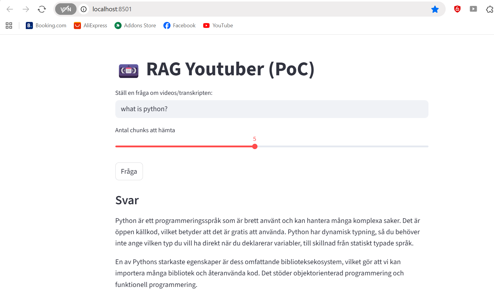

# RAG Youtuber (PoC)

## Overview
A Retrieval Augmented Generation chatbot built on YouTube transcripts.

## Architecture
- Transcripts → chunking → embeddings
- Vector DB: LanceDB
- Backend: FastAPI
- Frontend: Streamlit
- LLM: Gemini (free tier)

## How to run
1. Create venv
2. Install requirements
3. Run ingest
4. Run API
5. Run Streamlit

## Screenshots
()
